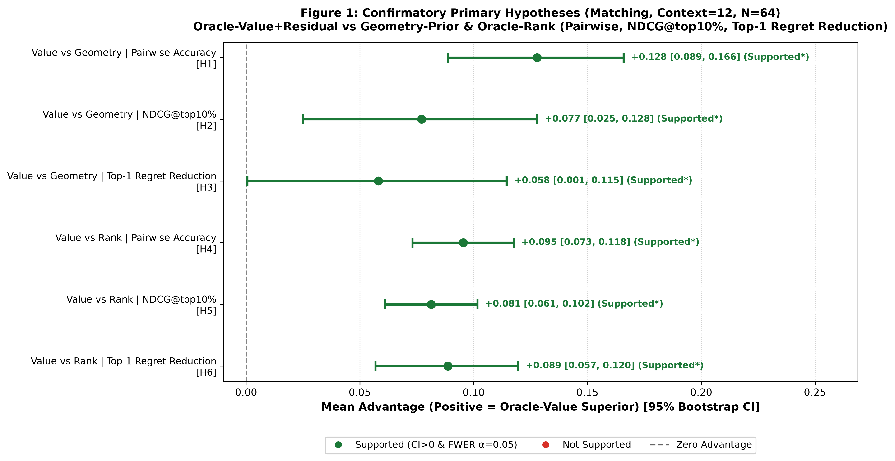
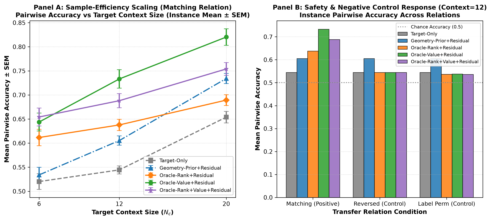

# Analysis Report: Oracle Benchmark Transfer Pilot v1

**Generated:** 2026-09-02 08:52:49 UTC  
**Protocol / Stage ID:** `oracle-benchmark-transfer-pilot-v1`  
**Confirmatory Slice:** `relation == matching`, `context_size == 12`, $N = 64$ independent instances `(problem, dimension, seed)`.  
**Multiple Testing & Decision Standard:** Holm-Bonferroni step-down correction at FWER $\alpha = 0.05$; Support requires **both** $\text{CI}_{0.025} > 0$ and $p_{\text{adj}} \le 0.05$.  

---

## 1. Executive Summary & Confirmatory Decisions

- **Primary Hypotheses Evaluated:** 6
- **Statistically Supported Hypotheses (CI > 0 & Holm $p \le 0.05$):** **6 / 6**
- **Decision Conclusion:** **CONFIRMATORY CRITERIA MET.** Across the 64 independent task instances, Oracle-Value+Residual demonstrates statistically supported overall advantages over both geometric and rank priors. Importantly, this reflects strong aggregate support across the benchmark suite rather than uniform superiority on every single problem family (see Section 2 for problem-level heterogeneity).

### Primary Confirmatory Hypothesis Results Table

| ID | Comparison | Baseline | Metric | Mean Value | Mean Base | Mean Adv [95% CI] | Raw $p$ | Holm $p$ | Supported? (CI>0 & p<0.05) |
| :--- | :--- | :--- | :--- | :--- | :--- | :--- | :--- | :--- | :---: |
| `H1` | Value vs Geometry | `Geometry-Prior+Residual` | Pairwise Accuracy | 0.7332 | 0.6053 | **+0.1279** [0.0888, 0.1659] | 2.5526e-07 | **1.0210e-06** | **YES (Supported)** |
| `H2` | Value vs Geometry | `Geometry-Prior+Residual` | NDCG@top10% | 0.7670 | 0.6899 | **+0.0771** [0.0250, 0.1279] | 0.0014 | **0.0028** | **YES (Supported)** |
| `H3` | Value vs Geometry | `Geometry-Prior+Residual` | Top-1 Regret Reduction | 0.1717 | 0.2298 | **+0.0581** [0.0006, 0.1145] | 0.0049 | **0.0049** | **YES (Supported)** |
| `H4` | Value vs Rank | `Oracle-Rank+Residual` | Pairwise Accuracy | 0.7332 | 0.6378 | **+0.0954** [0.0731, 0.1176] | 1.9113e-09 | **1.1468e-08** | **YES (Supported)** |
| `H5` | Value vs Rank | `Oracle-Rank+Residual` | NDCG@top10% | 0.7670 | 0.6857 | **+0.0814** [0.0609, 0.1017] | 3.3542e-09 | **1.6771e-08** | **YES (Supported)** |
| `H6` | Value vs Rank | `Oracle-Rank+Residual` | Top-1 Regret Reduction | 0.1717 | 0.2604 | **+0.0886** [0.0569, 0.1195] | 5.2540e-07 | **1.5762e-06** | **YES (Supported)** |

*Note: Advantage is defined such that positive values (+Adv) indicate Oracle-Value superiority across all 6 tests.*

---

## 2. Benchmark Problem-Level Heterogeneity (Context=12, Matching)

To avoid over-generalization, the table below breaks down the mean advantage of `Oracle-Value+Residual` by benchmark landscape:

| Problem Family | Value vs Geom (Pairwise) | Value vs Geom (NDCG) | Value vs Geom (Regret Red.) | Value vs Rank (Pairwise) | Value vs Rank (NDCG) | Value vs Rank (Regret Red.) |
| :--- | :---: | :---: | :---: | :---: | :---: | :---: |
| **Ackley** | **+0.2436** | **+0.1943** | **+0.1818** | **+0.1760** | **+0.1154** | +0.0930 |
| **GMM** | -0.0268 | -0.0904 | -0.0575 | +0.0190 | +0.0244 | +0.0454 |
| **Lunacek** | **+0.2511** | **+0.1879** | **+0.1234** | **+0.1550** | **+0.1400** | **+0.1194** |
| **Rastrigin** | +0.0436 | +0.0168 | -0.0154 | +0.0318 | +0.0457 | +0.0968 |

### Key Topographic Insights:
1. **Ackley & Lunacek (Strong Value Advantage):** Both problems exhibit complex, deceptive outer topographies where simple geometric proximity provides inadequate guidance. Continuous value transfer yields large improvements (Pairwise $\Delta \approx +0.24 \sim +0.25$, NDCG $\Delta \approx +0.19$, Top-1 Regret Reduction $\Delta \approx +0.12 \sim +0.18$).
2. **Rastrigin (Moderate Advantage):** Highly multimodal grid-like local basins benefit moderately from continuous value modeling (Pairwise $\Delta \approx +0.04$ vs Geometry; Regret Reduction $\Delta \approx +0.10$ vs Rank).
3. **GMM (Negative Advantage vs Geometry):** On GMM, the local basin around the mode is smooth and approximately isotropic quadratic. The `Geometry-Prior` perfectly fits this basin structure with zero parameter estimation noise, causing `Oracle-Value+Residual` to show slight negative deltas vs Geometry (Pairwise $\Delta = -0.0268$, NDCG $\Delta = -0.0904$, Regret Reduction $\Delta = -0.0575$). However, Value transfer remains superior to Rank transfer on GMM (+0.0190 Pairwise, +0.0244 NDCG, +0.0454 Regret Reduction).

---

## 3. Negative Control & Safety Analysis (Context=12)

Evaluation of negative control conditions demonstrates critical properties of transfer calibration:

- **Reversal Condition (`reversed`):**
  - Oracle-Value Fallback to Target-Only: **100.0%**
  - Oracle-Value Negative Transfer Rate: **0.0%**
  - Oracle-Rank Fallback to Target-Only: **100.0%**
  - Oracle-Rank Negative Transfer Rate: **0.0%**
  - *Mechanism:* Bounded non-negative calibration ($\beta_1 \ge 0$) cleanly clamps the inverted slope to zero, resulting in 100% safe fallback to Target-Only and 0% harmful transfer.

- **Randomized Control (`label_permutation`):**
  - Oracle-Value Fallback to Target-Only: **37.5%** (raw-shell evaluations)
  - Oracle-Value Negative Transfer Rate: **43.8%**
  - Oracle-Rank Fallback to Target-Only: **35.9%**
  - Oracle-Rank Negative Transfer Rate: **42.2%**
  - *Scientific Takeaway:* Under random label permutations where true correlation is zero, sample noise can still produce spuriously positive calibration slopes $\beta_1 > 0$ on small context samples ($N_c=12$). **Non-negative slope constraints alone cannot replace empirical cross-validation gating.**

---

## 4. Visualizations

### Figure 1: Confirmatory Primary Hypothesis Effect Sizes & 95% Bootstrap CIs

### Figure 2: Context Scaling & Negative Control Response

---

## 5. Aggregated Performance Summary (Context=12)

| Relation | Method | Pairwise Acc (Mean ± Std) | NDCG@top (Mean ± Std) | Top-1 Regret (Mean ± Std) | Independent Units |
| :--- | :--- | :--- | :--- | :--- | :---: |
| `label_permutation` | `Geometry-Prior+Residual` | 0.6053 ± 0.0771 | 0.6899 ± 0.1661 | 0.2298 ± 0.2156 | 64 |
| `label_permutation` | `Oracle-Rank+Residual` | 0.5367 ± 0.0650 | 0.5093 ± 0.1635 | 0.4543 ± 0.2265 | 64 |
| `label_permutation` | `Oracle-Rank+Value+Residual` | 0.5358 ± 0.0628 | 0.5121 ± 0.1576 | 0.4504 ± 0.2186 | 64 |
| `label_permutation` | `Oracle-Value+Residual` | 0.5377 ± 0.0631 | 0.5154 ± 0.1578 | 0.4559 ± 0.2230 | 64 |
| `label_permutation` | `Target-Only` | 0.5444 ± 0.0667 | 0.5458 ± 0.1777 | 0.4087 ± 0.2520 | 64 |
| `matching` | `Geometry-Prior+Residual` | 0.6053 ± 0.0771 | 0.6899 ± 0.1661 | 0.2298 ± 0.2156 | 64 |
| `matching` | `Oracle-Rank+Residual` | 0.6378 ± 0.0930 | 0.6857 ± 0.1479 | 0.2604 ± 0.2191 | 64 |
| `matching` | `Oracle-Rank+Value+Residual` | 0.6881 ± 0.1187 | 0.7373 ± 0.1656 | 0.2024 ± 0.2137 | 64 |
| `matching` | `Oracle-Value+Residual` | 0.7332 ± 0.1534 | 0.7670 ± 0.1888 | 0.1717 ± 0.2213 | 64 |
| `matching` | `Target-Only` | 0.5444 ± 0.0667 | 0.5458 ± 0.1777 | 0.4087 ± 0.2520 | 64 |
| `reversed` | `Geometry-Prior+Residual` | 0.6053 ± 0.0771 | 0.6899 ± 0.1661 | 0.2298 ± 0.2156 | 64 |
| `reversed` | `Oracle-Rank+Residual` | 0.5444 ± 0.0667 | 0.5458 ± 0.1777 | 0.4087 ± 0.2520 | 64 |
| `reversed` | `Oracle-Rank+Value+Residual` | 0.5444 ± 0.0667 | 0.5458 ± 0.1777 | 0.4087 ± 0.2520 | 64 |
| `reversed` | `Oracle-Value+Residual` | 0.5444 ± 0.0667 | 0.5458 ± 0.1777 | 0.4087 ± 0.2520 | 64 |
| `reversed` | `Target-Only` | 0.5444 ± 0.0667 | 0.5458 ± 0.1777 | 0.4087 ± 0.2520 | 64 |

---

## 6. Failure and Diagnostic Audit

- **Total Recorded Failures:** 0
- **Zero instance failures occurred.** All pipeline evaluations completed cleanly.

---

## 7. Provenance & Artifact Verification

- **Config SHA256:** `78b6d19be9e0275bbfa9236241d984f3d943aed566091e7c1e376b108c340992`
- **Results SHA256:** `b88667ffdb19d9650eef5831347d77eaa0eed9dfec35f6a4e820597f1f3a8f1d`
- **Diagnostics SHA256:** `c3c7c39459f0866bb42cdfb7d97877c4f80d8f412057b8fe214937c96f9a7174`
- **Failures SHA256:** `e7e006afd6b1da7846163626fefb875a4c97b4aa02d2fe487bdd5ecfa8b1ac8d`
- **Analyzer Script SHA256:** `e78f72a6b9a66dd56fa8c8cea58ba00b648186ac7dd823406f53dc2edb68c283`
